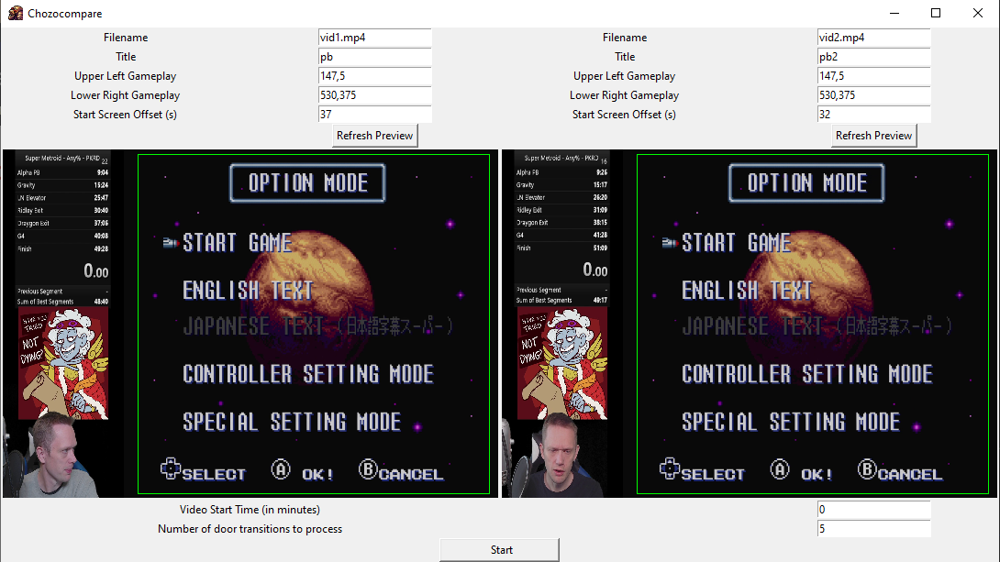
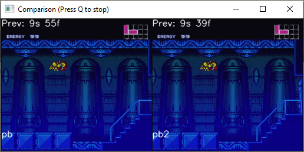

Chozocompare
==============================

Tool for compositing two Super Metroid videos on a room by room basis.  Could probably be made to compare other game videos too.

Requirements
------------
Python 3.8

Installation
------------
Clone the repo or download the files.  Or download one of the releases made with pyinstaller

Usage
-----

```shell
~/chozocompare/gui> python chozocompare.py
```

In order to compare two videos, the two videos must meet these criteria:
1. They must visit the rooms in the exact same order
2. They must be (at least about) the same frame rate, trying to compare a 60fps video and a 30fps video won't work

Note that the higher the framerate, and the larger the video, the longer it will take to process.

### Download the videos
You can download the videos however you want.  This is easy if they're both your own videos (Twitch provides links for you to download them)

You can use [twitch-dl](https://github.com/ihabunek/twitch-dl) to download other videos from Twitch.  Make sure you convert them to mp4 before using them.  I use [https://ffmpeg.org/](ffmpeg) to do so:
```shell
ffmpeg.exe -i input_video.mkv -codec copy input_video.mp4
```

### Configure the videos

Opening Chozocompare will show this window:



Fill out the values for both videos:

**Filename** the mp4 file for the video

**Title** the title that will be displayed at the bottom of the video

**Upper Left Gameplay** x,y coordinate of the upper lefthand corner of the gameplay in the video

**Lower Right Gameplay** x,y coordinate of the lower righthand corner of the gameplay in the video

**Start Screen Offset** the offset, in seconds of the start screen. You can skip around in the video to find good cropping frames too.

**Refresh Preview** shows the current config so you can confirm that it's good.  

Make sure if you update the values to click refresh preview to save them.

**Video Start Time** Allows you to start the composite video at a later time.  This essentially skips to that minute in both videos.  notes that the offsets will likely be different further into the video.

**Number of Door Transitions** Allows you to choose how many door transitions to compare.  If you want the full run just put in a large value like 999

After that's all filled out, just click "Start".  The comparison video will pop up to show you the progress.  It will take *a while*.  you can pres Q to cancel the comparison, any video that's been written up to that point should still be good.



### Video Tips

The better the capture the better the results.  If you have bit alerts/emotes/funny gifs etc in the gameplay portion of the video it will likely cause problems with the door transition detection.

It can take quite a while to process, especially if you're using large video files.

Make sure you're not including extra boarder around the gameplay that is black.  It'll likely result in door transitions not being recognized.
